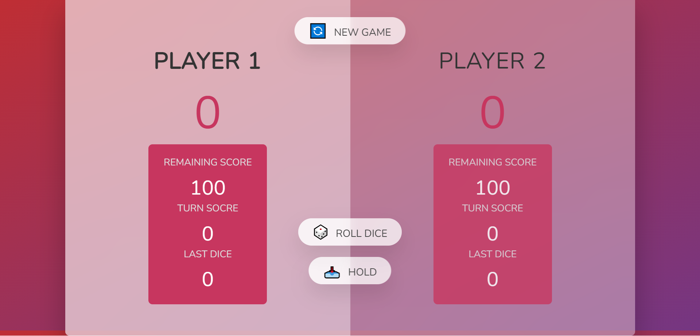

# Dice Rolling Game

[The Other Projects](https://github.com/mAbdullah821/javascript-projects)

Welcome to the Dice Rolling Game! This is a JavaScript game where the goal is to reach a score of 100 as fast as possible. The game is played by two players, and each player takes turns rolling a dice and accumulating points.

## How to Play

1. The first player clicks on the "Roll Dice" button to roll a dice and get a value from 1 to 6.
2. The value of the dice roll is added to the player's turn score.
3. The player can choose to either "Hold" their turn, which adds their turn score to their total score and ends their turn, or they can choose to "Roll Dice" again.
4. If the player chooses to "Roll Dice" again, and they roll a value less than what they rolled in their previous turn, they lose their turn and their turn score is reset to 0.
5. The turn then passes to the second player, who repeats steps 1-4.
6. The game continues until one player reaches a total score of 100.
7. At the end of the game, each player must get the exact remaining score to achieve 100 points. If a player's turn score plus their total score becomes more than 100, they will lose their turn and their turn score will be reset to 0.

## How to Win

The winner of the game is the first player to reach a total score of 100 or more, while also ensuring that their total score does not exceed 100 points.

I hope you enjoy playing this game and testing your luck with the dice rolls! Have fun and good luck!
