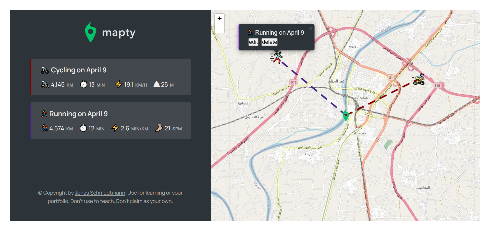

# Sports Activity Tracking App

[The Other Projects](https://github.com/mAbdullah821/javascript-projects)

Welcome to the Sports Activity Tracking App! This is a JavaScript application that allows you to track your running or biking activities using your device's location. The app uses a third-party API to preview a map and your location in the map, and allows you to add activities and track your progress.

## Features

- Location Access: The app asks for permission to access your location, which is used to show your current location on the map.
- Map Preview: The app uses a third-party API to show a map preview with your current location.
- Activity Creation: You can click on any location in the map to create a new activity. The app presents a simple and cool design form where you can enter information about your activity, such as the type of activity, distance, and time.
- Activity Log: After creating an activity, the app displays a log for that activity on the map with a dashed line pointing from your current location to the target location. The distance from you to the target location is also displayed.
- Activity Editing: You can edit or delete an activity by clicking on the activity logo on the map. This will show a form with two buttons, "edit" and "delete", which allow you to modify or remove the activity as needed.
- Multiple Activities: You can add more than one activity to the map, and each activity will be displayed with its own logo on the map.
- Smooth Transition: If you are far away from an activity and don't know where the target location is, you can click on the activity info in the left section. This will smoothly transition you from your current location to the target location.

## How to Use

1. Allow the app to access your location when prompted.
2. Click on any location in the map to create a new activity.
3. Fill out the required fields in the activity creation form and click "Enter".
4. The app will display a log for your activity on the map with a dashed line pointing from your current location to the target location.
5. To edit or delete an activity, click on the activity logo on the map and select "edit" or "delete".
6. To view an activity's target location, click on the activity info in the left section.

I hope you enjoy using this app to track your sports activities and improve your performance! If you have any questions or feedback, please don't hesitate to reach out.
