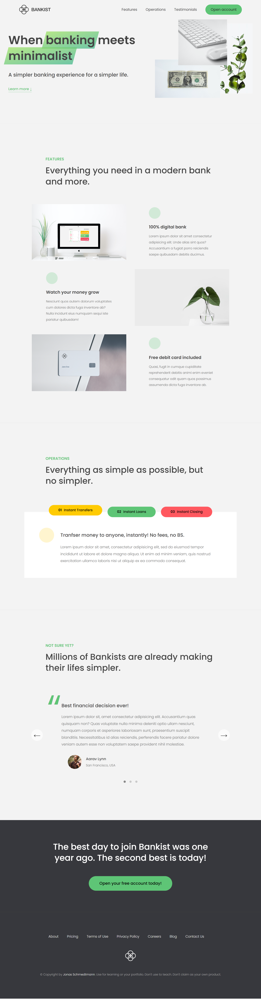

# Stylish JavaScript Website

[The Other Projects](https://github.com/mAbdullah821/javascript-projects)

Welcome to my stylish JavaScript website! This website is designed to showcase my skills in web development and JavaScript programming. Here are some of the features you'll find on my website:

## Navigation Bar Cool Hover

When you hover over the navigation bar links, you'll see a cool hover effect that adds some visual interest to the design.

## Smooth Scrolling to Different Sections

As you scroll down the page, you'll notice that the sections smoothly and visually transition into view. This creates a seamless browsing experience for users and adds a touch of style to the design.

## Sticky Navigation Bar

As you scroll down the page, the navigation bar will become sticky and remain visible at the top of the screen. This makes it easy for users to navigate through the site, even on long pages.

## Section Transition Lazy Load

To improve performance and reduce load times, my website uses section transition lazy load for both the sections and internal images. This means that sections and images are loaded only when they are needed, resulting in faster load times and a better user experience.

I hope you enjoy exploring my website and seeing what I can do with JavaScript and web development. If you have any questions or feedback, please don't hesitate to reach out!
